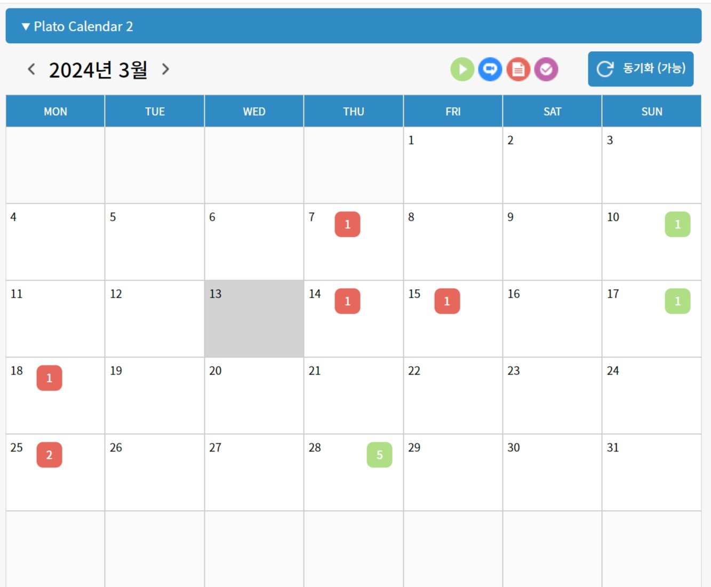
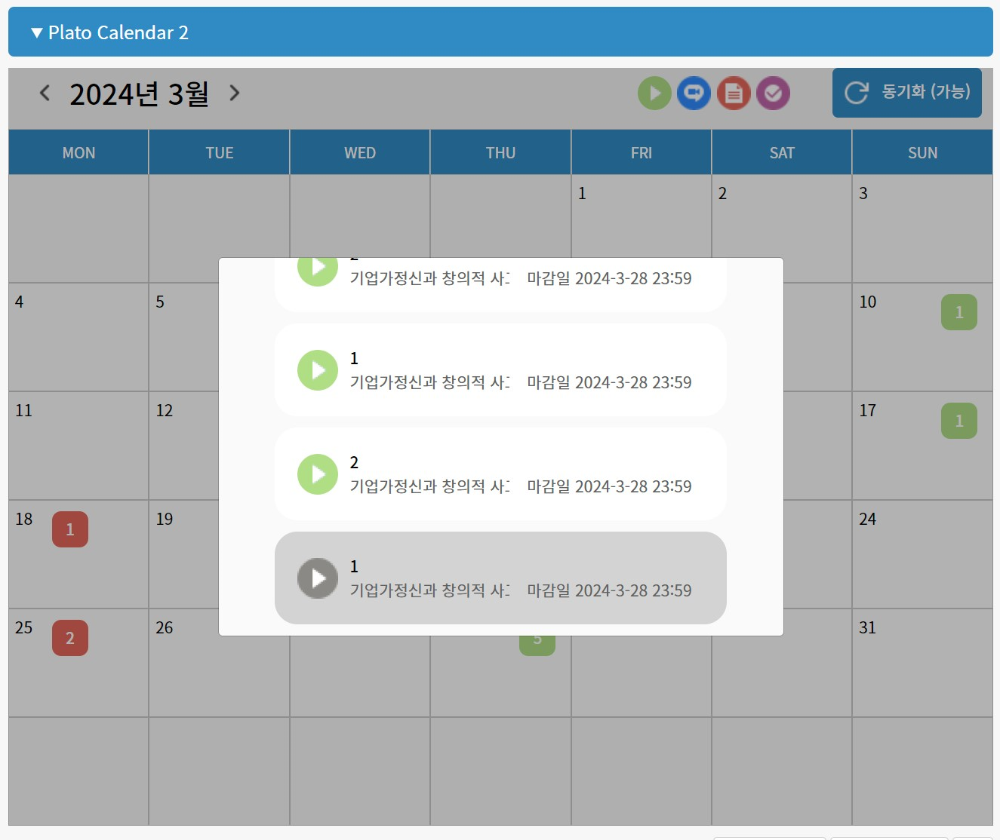

# PLATO CALENDAR 2

### 프로젝트 소개

플라토 과제 정보를 크롤링하여 제공하는 크롬 확장 프로그램입니다.

### 프로젝트 목적

부산대학교 교육플랫폼 플라토를 사용하는 학생들이 제출하거나 완료해야 하는 과제를 한 눈에 알아볼 수 있도록 하는 캘린더를 제공하고자 합니다.

### 주요 기능

- 일자별 {과제, 퀴즈, 동영상, 화상강의} 정보 및 제출 여부 제공
- 과제 정보 바로가기 제공

### 스크린샷

### 참고

- https://github.com/whquddn55/Plato_Calendar

### 팀원

<table>
  <tr>
    <td align="center">
      <a href="https://github.com/hdh4952">
        
         
        <b>hdh4952</b>
      </a>
       
    </td>
    <td align="center">
      <a href="https://github.com/mun-kyeong">
      
       
      <b>	mun-kyeong</b>
      </a>
       
    </td>
  </tr>
</table>
